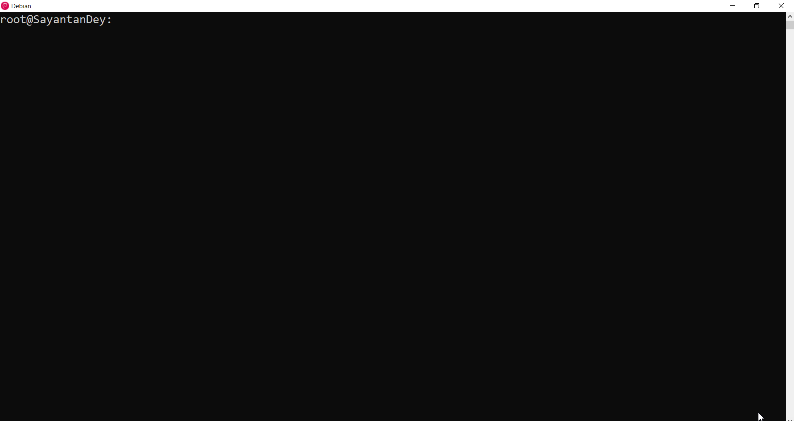

# SQLServerCoverage 

##### Code coverage for SQL Server T-SQL 

##### Extended From [SQLCover](https://github.com/GoEddie/SQLCover).

> This project is based on [SQLCover](https://github.com/GoEddie/SQLCover) with additional features, bug fix and maintenances planned ahead.

**SQLServerCoverage** is a tool for checking code coverage (both line and branch) of tests executed in SQL sever 2008 and above.


## Functionalities/Fixes added:

:white_check_mark: Generate HTML Report Directly 

:white_check_mark: Branch Coverage

:white_check_mark: CLI tools for different platforms 

:white_check_mark: Detailed documentation for setup

:white_check_mark: Output SQL Server Generated Messages during Execution
##### Code coverage for SQL Server T-SQL (From [SQLCover](https://github.com/GoEddie/SQLCover)).

**SQLServerCoverage** is a tool for checking code coverage (both line and branch) of tests executed in SQL sever 2008 and above.

> This project is based on [SQLCover](https://github.com/GoEddie/SQLCover) with additional features, bug fix and maintenances planned ahead.

## Functionalities/Fixes added:

* Branch Coverage
* CLI tools for different platforms 
* Detailed documentation for setup

### [Html Report Sample [Using Report Generator]](https://raw.githack.com/sayantandey/SQLServerCoverage/main/example/Test%20Example/index.html)

____

# Index

 - [Download](#download)
 - [Build](#build)
 - [Installation](#installation)
 - [Usage](#usage)
   - [1. CLI](#1-cli)
   - [2. Cover tSQLt Scripts](#2-cover-tsqlt-script)
   - [3. Check Coverage Asynchronously ](#3-check-coverage-asynchronously )
 - [Tidying up](#tidying-up)

## Download

Download the [latest release](https://github.com/sayantandey/SQLServerCoverage/releases/tag/V1.0) from the released packages. 

**Note:** If you are unable to find a release compatible for your system, consider building it from the codebase using `dotnet` tool . 

Read the [build](#build ) section for building the tool.

## Build 

##### Follow these steps to build the tool for your environment 

* From the project root directory

  ```
  dotnet publish src/SQLServerCoverageCore/SQLServerCoverageCore.csproj  -c Release  -r <RUNTIME_IDENTIFIER> -o "releases/<RUNTIME_IDENTIFIER>" --self-contained true  -p:PublishSingleFile=true
  ```

  > For `RUNTIME_IDENTIFIER` put the os version for your system. 
  >
  > [Check this source to choose a runtime](https://learn.microsoft.com/en-us/dotnet/core/rid-catalog) 

* Once finished, fetch the binary from `/releases/<RUNTIME_IDENTIFIER>` directory.


## Installation

1. Put the tool in a directory of your preference.
2. Use the path to that directory as your environment variable 

___

## Usage

### 1. CLI

```bash
SQLServerCoverageCore

  -v, --verbose             Set output to verbose messages.

  -c, --command             Required. Choose command to run from: Get-CoverTSql, Get-CoverExe.

  -e, --exportCommand       Required. Choose command to run from:Export-OpenXml, Export-Html

  -b, --debug               Prints out detailed output.

  -p, --requiredParams      Get required parameters for a command

  -k, --connectionString    Connection String to the sql server

  -d, --databaseName        Default Database

  -q, --query               Sql Query, Ex. tSQLt.runAll

  -o, --outputPath          Output Path

  -a, --args                Arguments for an exe file

  -t, --exeName             executable name

  --help                    Display this help screen.

  --version                 Display version information.
```

### Example:

##### 1. OpenCover Format

Generate the coverage report as xml

```bash
SQLServerCoverageCore -v true -c Get-CoverTSql -e Export-OpenXml -d <DATABASE_NAME> -q <Query> -o <OUTPUT_PATH> -k <CONNECTION_STRING>
```

This will generate the OpenCover xml report in `OUTPUT_PATH` along with the source files in the database it is executed.

##### 2. HTML Format

Generate the coverage report as html. It leverages ReportGenerator to Generate Inline HTML Report of Coverage.

```bash
SQLServerCoverageCore -v true -c Get-CoverTSql -e Export-Html -d <DATABASE_NAME> -q <Query> -o <OUTPUT_PATH> -k <CONNECTION_STRING>
```



___

### 2. Cover tSQLt Script

> [tSQLt](http://tsqlt.org/) is a unit testing framework for Microsoft SQL Server. 

It can be used with tSQLt framework to check the coverage.

### 2. Cover T-SQL Script

If you have a script you want to cover then you can call:

```
SQLServerCoverageCore -v true -c Get-CoverTSql -e Export-OpenXml -d <DATABASE_NAME> -q "exec tSQLt.RunAll" -o <OUTPUT_PATH> -k <CONNECTION_STRING>
```

This will generate a openxml coverage report where you can either examine the amount of statement covered or use the report to generate HTML report using [ReportGenerator](https://github.com/danielpalme/ReportGenerator).

___

### 3. Check Coverage Asynchronously 

> :construction: This will soon be made available to be used from CLI. Now DLL need to be used.

### 3. Cover anything else

If you want to have more control over what is covered, you can start a coverage session, run whatever queries you like from whatever application and then stop the coverage trace and get the CoverageResults which you can then use to generate a report.

```
$coverage = new-object SQLServerCoverage.CodeCoverage($connectionString, $database)
$coverage.Start()
#Execute The SQL scripts
$coverageResults = $coverage.Stop()
```


___

 ## Tidying up

 When we target local sql instances we delete the trace files but when targetting remote instances we are unable to delete the files as we do not (or potentially) do not have access. If this is the case keep an eye on the log directory and remove old "SQLServerCoverage-Trace-*.xel" and "SQLServerCoverage-Trace-*.xem" files. 
